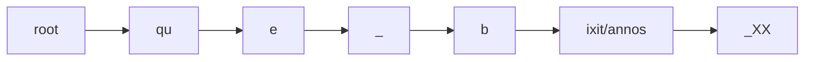
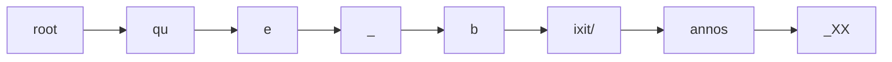

# Addenda

An item is rendered via an item composer, which implements the `IItemComposer` interface. Text items are the most complex for rendering, so let us consider them first.

Let us start from a 2-lines token-based text like this:

```txt
que bixit
annos XX
```

Let us say that there are the following layer fragments:

- orthography fragment 1 on `qu[e]` (`1.1@3`).
- orthography fragment 2 on `[b]ixit` (`1.2@1`).
- paleography fragment 1 on `qu[e b]ixit` (a ligature: `1.1@3-1.2@1`).
- comment fragment 1 on `bixit annos` (`1.2-2.1`).

In this example we want to render all these layers, but you are free to select only the ones you want.

▶️ (1) **flatten layers**: use a text part flattener (`ITextPartFlattener`) to get the whole text into a multiline string, plus one range for each fragment in each of the picked layer parts.

- text: `que bixit|annos XX` (where `|` stands for a LF character, used as the line delimiter).
- ranges:
  1. 2-2 for `qu[e]`: fragment ID=`it.vedph.token-text-layer:fr.it.vedph.orthography_0`;
  2. 4-4 for `[b]ixit`: fragment ID=`it.vedph.token-text-layer:fr.it.vedph.orthography_1`;
  3. 2-4 for `qu[e b]ixit`: fragment ID=`it.vedph.token-text-layer:fr.it.vedph.apparatus_0`;
  4. 4-14 for `bixit|annos`: fragment ID=`it.vedph.token-text-layer:fr.it.vedph.comment_0`.

Each of the ranges has a model including:

- the start and end indexes referred to the whole text as output by the same function.
- the global ID of the corresponding fragment(s). After flattening, each range has just a single fragment ID, because by definition one fragment produces one range. Later, when ranges are merged, they may carry more than a single fragment ID. Each fragment ID is built by concatenating the part type ID, followed by `:` and its role ID (which is always defined for a layer part), followed by `_` and the index of the fragment in its layer part.
- the text corresponding to the range. This is assigned after flattening and merging, for performance reasons (it would be pointless to assign text to all the ranges when many of them are going to be merged into new ones).

At this stage we have a string with the text, and a bunch of freely overlapping ranges referring to it. The next step is merging these ranges into a single linear, contiguous sequence.

▶️ (2) **merge ranges** (via `FragmentTextRange.MergeRanges`) into a set of non-overlapping and contiguous ranges, covering the whole text from start to end. So, starting from this state, where each line below the text represents a range with its fragment ID:

```txt
012345678901234567
que bixit|annos XX
..O............... fr1
....O............. fr2
..PPP............. fr3
....CCCCCCCCCCC... fr4
```

we get these ranges:

1. 0-1 for `qu` = no fragments;
2. 2-2 for `e` = fr1, fr3;
3. 3-3 for space = fr3;
4. 4-4 for `b` = fr2, fr3, fr4;
5. 5-14 for `ixit|annos` = fr4;
6. 15-17 for space + `XX` = no fragments.

```txt
012345678901234567
que bixit|annos XX
112345555555555666
```

▶️ (3) **assign text values** to each merged range. This is trivial as it just means getting substrings from the whole text, as delimited by each range.

▶️ (4) **build a text tree**: this tree is built from a blank root node, having in a single branch descendant nodes corresponding to the merged ranges. The first range is child of the blank root node, and each following range is child of the previous one.

Each node has a payload with this model:

- range: the original fragment range.
- text: the text corresponding to this node. Initially this is equal to the source range's text, but it might be changed by filters.
- features: a set of generic name=value pairs, where both are strings. Duplicate names are allowed and represent arrays. Initially these are empty, but they are going to be used later.

So the tree is:



▶️ (5) **apply text tree filters**: optionally, apply filters to the tree nodes. Each of the filters takes the input of the previous one and generates a new tree. Typically, an essential filter here is the block linear tree text filter, which splits nodes wherever they include newlines. This ensures that each node has at most 1 newline, and that it appears at the end of its text. This is often required to ensure that text blocks will be correctly rendered. The result is:



▶️ (6) **render the text tree** (via an `ITextTreeRenderer`):
