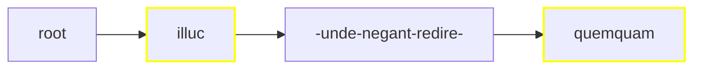

# Addenda

## Building Trees

An item is rendered via an item composer, which implements the `IItemComposer` interface. Text items are the most complex for rendering, so let us consider them first.

Let us start from a 2-lines token-based text like this:

```txt
que bixit
annos XX
```

Let us say that there are the following layer fragments:

- orthography fragment 1 on `qu[e]` (`1.1@3`).
- orthography fragment 2 on `[b]ixit` (`1.2@1`).
- paleography fragment 1 on `qu[e b]ixit` (a ligature: `1.1@3-1.2@1`).
- comment fragment 1 on `bixit annos` (`1.2-2.1`).

In this example we want to render all these layers, but you are free to select only the ones you want.

▶️ (1) **flatten layers**: use a text part flattener (`ITextPartFlattener`) to get the whole text into a multiline string, plus one range for each fragment in each of the picked layer parts.

- text: `que bixit|annos XX` (where `|` stands for a LF character, used as the line delimiter).
- ranges:
  1. 2-2 for `qu[e]`: fragment ID=`it.vedph.token-text-layer:fr.it.vedph.orthography@0`;
  2. 4-4 for `[b]ixit`: fragment ID=`it.vedph.token-text-layer:fr.it.vedph.orthography@1`;
  3. 2-4 for `qu[e b]ixit`: fragment ID=`it.vedph.token-text-layer:fr.it.vedph.apparatus@0`;
  4. 4-14 for `bixit|annos`: fragment ID=`it.vedph.token-text-layer:fr.it.vedph.comment@0`.

Each of the ranges has a model including:

- the start and end indexes referred to the whole text as output by the same function.
- the global ID of the corresponding fragment(s). After flattening, each range has just a single fragment ID, because by definition one fragment produces one range. Later, when ranges are merged, they may carry more than a single fragment ID. Each fragment ID is built by concatenating the part type ID, followed by `:` and its role ID (which is always defined for a layer part), followed by `_` and the index of the fragment in its layer part.
- the text corresponding to the range. This is assigned after flattening and merging, for performance reasons (it would be pointless to assign text to all the ranges when many of them are going to be merged into new ones).

At this stage we have a string with the text, and a bunch of freely overlapping ranges referring to it. The next step is merging these ranges into a single linear, contiguous sequence.

▶️ (2) **merge ranges** (via `FragmentTextRange.MergeRanges`) into a set of non-overlapping and contiguous ranges, covering the whole text from start to end. So, starting from this state, where each line below the text represents a range with its fragment ID:

```txt
012345678901234567
que bixit|annos XX
..O............... fr1
....O............. fr2
..PPP............. fr3
....CCCCCCCCCCC... fr4
```

we get these ranges:

1. 0-1 for `qu` = no fragments;
2. 2-2 for `e` = fr1, fr3;
3. 3-3 for space = fr3;
4. 4-4 for `b` = fr2, fr3, fr4;
5. 5-14 for `ixit|annos` = fr4;
6. 15-17 for space + `XX` = no fragments.

```txt
012345678901234567
que bixit|annos XX
112345555555555666
```

▶️ (3) **assign text values** to each merged range. This is trivial as it just means getting substrings from the whole text, as delimited by each range.

▶️ (4) **build a text tree**: this tree is built from a blank root node, having in a single branch descendant nodes corresponding to the merged ranges. The first range is child of the blank root node, and each following range is child of the previous one.

Each node has _payload_ data with this model:

- range: the source merged range with its fragment ID(s).
- type: an optional string representing a node type when required.
- before EOL: true if node is appeared before a line end marker (LF) in the original text.
- text: the text corresponding to this node. Initially this is equal to the source range's text, but it might be changed by filters.
- features: a set of generic name=value pairs, where both are strings, plus a source identifier (equal to or derived from the fragment ID). Duplicate names are allowed and represent arrays. Initially these are empty, but they are going to be used later.

So the tree is:


>The tree structure may seem an overcomplication when dealing with a single linear branch, but it is really useful when rendering more complex data. See below for more.

Note that here a node contains text with a LF character, which is used to mark the end of the original line. Typically this is adjusted in the next step so that such nodes are split.

▶️ (5) **apply text tree filters**: optionally, apply filters to the tree nodes. Each of the filters takes the input of the previous one and generates a new tree. Almost always you will be using the _block linear tree text filter_, which splits nodes wherever they include newlines. This ensures that each node has at most 1 newline, and that it appears at the end of its text. This is required to ensure that text blocks will be correctly rendered. The result is:


▶️ (6) **render the text tree** (via an `ITextTreeRenderer`). A text tree renderer traverses the tree and renders it into some specific format.

### Critical apparatus

When an apparatus is involved, this can potentially modify the text by selecting specific variants or normalized forms. In this case, special filters can be applied to modify the text and features of nodes before further processing.

The approach depends on the complexity of the source data. Let us consider various scenarios, from the simplest to the most complex ones.

The standard [apparatus](https://github.com/vedph/cadmus-philology/blob/master/docs/fr.apparatus.md) fragment model is (I add the feature name after each property converted to a feature during processing):

- location
- tag (`app-tag`)
- entries:
  - subrange
  - tag (`app.e.tag`)
  - value  (`app.e.variant`, when type is not note)
  - normValue
  - isAccepted
  - groupId
  - witnesses:
    - value (`app.e.witness`)
    - note (`app.e.witness.note`)
  - authors:
    - tag
    - value (`app.e.author`)
    - location (`app.e.author.loc`)
    - note (`app.e.author.note`)
  - note (`app.e.note`)

#### Linear Single Layer

In this approach we just have a _single_ layer with _apparatus_. So, merging just projects the apparatus ranges on the whole text; the text is segmented only according to the apparatus fragments.

>Given that we deal with a single layer, we can be sure there is no overlap: this is a constraint imposed to the Cadmus text layers model. This constraint, somewhat artificial for the Cadmus model itself, was designed for compatibility reasons, to make it simpler to deal with third-party models in exports or visualizations.

For instance, say we have this simple text:

```txt
012345678901234567890123456789012
illuc unde negant redire quemquam
AAAAA....................BBBBBBBB
```

with 2 fragments in the apparatus, one (A) with 3 entries, and another (B) with 2:

- A0: note: witnesses=`O1`, accepted.
- A1: replacement: value=`illud`, witnesses=`O G R`.
- A2: replacement: value=`illic`, authors=`Fruterius` with note=`(†1566) 1605a 388`.
- B0: note: witnesses=`O G`, accepted.
- B1: replacement: value=`umquam`, witnesses=`R`, note=`some note`.

The merged ranges would be:

1. 0-4 for `illuc`: fragment ID=`it.vedph.token-text-layer:fr.it.vedph.apparatus@0`;
2. 25-32 for `quemquam`: fragment ID=`it.vedph.token-text-layer:fr.it.vedph.apparatus@1`.



>In this diagram, yellow borders mark nodes linked to apparatus fragments and dashes represent spaces.

Given that we have a single layer, we won't need to add or delete nodes, but just to change their payload data adding an **apparatus linear tree text filter** to ▶️ step (5). So, traversing our nodes this layer generates features for nodes linked to apparatus fragments:

1. `illuc` is linked to fragment 0:
    - from entry 0 (source `it.vedph.token-text-layer:fr.it.vedph.apparatus@0.0`):
      - `app.e.witness`=`O1`
    - from entry 1 (source `it.vedph.token-text-layer:fr.it.vedph.apparatus@0.1`):
      - `app.e.variant`=`illud`
      - `app.e.witness`=`O`
      - `app.e.witness`=`G`
      - `app.e.witness`=`R`
    - from entry 2 (source `it.vedph.token-text-layer:fr.it.vedph.apparatus@0.2`):
      - `app.e.variant`=`illic`
      - `app.e.author`=`Fruterius`
      - `app.e.author.note`=`(†1566) 1605a 388`
2. `quemquam` is linked to fragment 1:
    - from entry 0 (source `it.vedph.token-text-layer:fr.it.vedph.apparatus@1.0`):
      - `app.e.witness`=`O`
      - `app.e.witness`=`G`
    - from entry 1 (source `it.vedph.token-text-layer:fr.it.vedph.apparatus@1.1`):
      - `app.e.variant`=`umquam`
      - `app.e.witness`=`R`
      - `app.e.note`=`some note`

At this stage, we're done with the tree and we can move to ▶️ step (6) for rendering it. Rendition depends on the desired output format; for this example, let's keep things simple and say that we want a TEI text fragment like this (witnesses and other attributes are fake data assumed to be in the fragments, and text is indented for more readability):

```xml
<p>
    <app>
      <lem wit="#O1">illuc</lem>
      <rdg wit="#O #G #R">illud</rdg>
      <rdg id="var1" resp="#Fruterius">
        illic
        <note>(†1566) 1605a 388</note>
      </rdg>
      <witDetail target="#var1" resp="#Fruterius">p.c.</witDetail>
    </app>
    unde negant redire
    <app>
      <lem wit="#O #G">quemquam</lem>
      <rdg wit="#R">umquam</rdg>
    </app>
</p>
```

We can easily build this TEI code by just traversing our tree:

1. at root, start with a block element (`p` in this case);
2. `illuc`: as the node is linked to a fragment, add an `app` element and inside it add a `lem` element with the node's text as text, and as many `rdg` elements as variants with the variant value as text;
3. `unde negant redire` (surrounded by spaces) is not linked to fragments, so just output it as text;
4. `quemquam`: linked to fragment, so process as for 2 above;
5. close the block.

So the rules for this simple renderer would be:

- use a specific element for blocks (e.g. `p` for prose, `l` for verses):
  - open a block at root;
  - close and reopen the block after each node before a newline;
  - close the block at end.

- if the node has apparatus feature(s):
  - add an `app` element with content:
    - `lem` = node text with `@wit` for witnesses, `@resp` for authors, a child `note` for note. Also, for each witness/author having its own note, add a `witDetail` sibling with `@target` pointing to the witness/author element, `@wit` or `@resp` with the value of the author/witness, and content=note's value.
    - `rdg` = variant text, with attributes and children as above.
- else just output the node's text.
