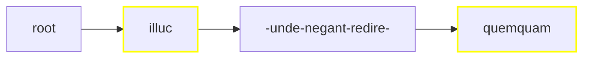

# Rendering Critical Text

Rendering a critical apparatus is especially complex because it involves many different rendition strategies according to the source data and the target format. Let us consider various scenarios, from the simplest to the most complex ones.

Before illustrating these examples, let us recap the standard [apparatus](https://github.com/vedph/cadmus-philology/blob/master/docs/fr.apparatus.md) fragment model:

- location
- tag
- entries:
  - subrange
  - tag
  - value
  - normValue
  - isAccepted
  - groupId
  - witnesses:
    - value
    - note
  - authors:
    - tag
    - value
    - location
    - note
  - note

The apparatus model essentially represents variants as edit operations on the base text. So, a variant like `illic` for the base text `illuc` is represented as a replacement operation (type=replacement). When instead we just want to add metadata, e.g. to list the witnesses for `illuc`, the lemma accepted in the reconstructed text, we use a note type. In this case the value is null (when it is an empty string, this is a zero variant, i.e. an omission or deletion).

## Linear Single Layer

- tree: linear;
- layers: single (=apparatus only).

In this approach we have selected a _single_ layer, the apparatus. So, merging just projects the apparatus ranges on the whole text; the text is segmented only according to the apparatus fragments.

>Given that we deal with a single layer, we can be sure there is no overlap: this is a constraint imposed to the Cadmus text layers model. This constraint, somewhat artificial for the Cadmus model itself, was designed for compatibility reasons, to make it simpler to deal with third-party models in exports or visualizations.

Say we have this simple text:

```txt
012345678901234567890123456789012
illuc unde negant redire quemquam
AAAAA....................BBBBBBBB
```

Here we have 2 fragments in the apparatus layer part, one (A) with 3 entries, and another (B) with 2. For brevity I am quoting the fragments with A and B and their entries with their index (0, 1, etc.):

- A0:
  - note entry: witnesses=`O1`, accepted.
- A1:
  - replacement entry: value=`illud`, witnesses=`O G R`.
- A2:
  - replacement entry: value=`illic`, authors=`Fruterius` with note=`(†1566) 1605a 388`.
- B0:
  - note entry: witnesses=`O G`, accepted.
- B1:
  - replacement entry: value=`umquam`, witnesses=`R`, note=`some note`.

>To keep things simpler, in this example each fragment has a single entry, but we could well have many of them.

The merged ranges would be:

1. 0-4 for `illuc`: fragment ID=`it.vedph.token-text-layer:fr.it.vedph.apparatus@0`;
2. 25-32 for `quemquam`: fragment ID=`it.vedph.token-text-layer:fr.it.vedph.apparatus@1`.



>In this diagram, yellow borders mark nodes linked to apparatus fragments and dashes represent spaces.

At this stage, we're done with the tree and we can move to its rendering. Rendition depends on the desired output format; for this example, let's keep things simple and say that we want a TEI text fragment like this (witnesses and other attributes are fake data assumed to be in the fragments, and text is indented for more readability):

```xml
<p>
    <app n="1">
      <lem n="1" wit="#O1">illuc</lem>
      <rdg n="2" wit="#O #G #R">illud</rdg>
      <rdg n="3" xml:id="rdg1" resp="#Fruterius">illic</rdg>
      <witDetail target="#rdg1" resp="#Fruterius">(†1566) 1605a 388</witDetail>
    </app>
    unde negant redire
    <app n="2">
      <lem n="1" wit="#O #G">quemquam</lem>
      <rdg wit="#R">
        umquam
        <note>some note</note>
      </rdg>
    </app>
</p>
```

We can easily build this TEI code by just traversing our tree:

1. at root, start with a block element (`p` in this case);
2. `illuc`: as the node is linked to a fragment, add an `app` element and inside it add a `lem` element with the node's text as text, and as many `rdg` elements as variants with the variant value as text;
3. `unde negant redire` (surrounded by spaces) is not linked to fragments, so just output it as text;
4. `quemquam`: linked to fragment, so process as for 2 above;
5. close the block.

So the rules for this simple renderer would be:

- use a specific element for blocks (e.g. `p` for prose, `l` for verses):
  - open a block at root;
  - close and reopen the block after each node before a newline;
  - close the block at end.

- if the node has apparatus feature(s):
  - add an `app` element with content:
    - `lem` = node text with `@wit` for witnesses, `@resp` for authors, a child `note` for note. Also, for each witness/author having its own note, add a `witDetail` sibling with `@target` pointing to the witness/author element, `@wit` or `@resp` with the value of the author/witness, and content=note's value.
    - `rdg` = variant text, with attributes and children as above.
- else just output the node's text.

>As you can see from the example, the renderer also adds `@n` attributes with the ordinal numbers of fragments (rendered into `app` elements) and entries (rendered into `lem` or `rdg` elements).
