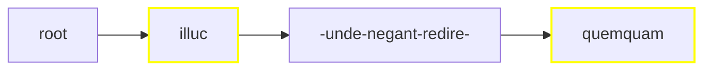

# Rendering Critical Text

Rendering a critical apparatus is especially complex because it involves many different rendition strategies according to the source data and the target format. Let us consider various scenarios, from the simplest to the most complex ones.

Before illustrating these examples, let us recap the standard [apparatus](https://github.com/vedph/cadmus-philology/blob/master/docs/fr.apparatus.md) fragment model (I add the feature name after each property converted to a feature during certain types of processing):

- location
- tag (`app-tag`)
- entries:
  - subrange
  - tag (`app.e.tag`)
  - value  (`app.e.variant`, when type is not note)
  - normValue
  - isAccepted
  - groupId
  - witnesses:
    - value (`app.e.witness`)
    - note (`app.e.witness.note`)
  - authors:
    - tag
    - value (`app.e.author`)
    - location (`app.e.author.loc`)
    - note (`app.e.author.note`)
  - note (`app.e.note`)

## Linear Single Layer

- tree: linear
- layers: single (=apparatus only)

In this approach we just have selected a _single_ layer, the apparatus. So, merging just projects the apparatus ranges on the whole text; the text is segmented only according to the apparatus fragments.

>Given that we deal with a single layer, we can be sure there is no overlap: this is a constraint imposed to the Cadmus text layers model. This constraint, somewhat artificial for the Cadmus model itself, was designed for compatibility reasons, to make it simpler to deal with third-party models in exports or visualizations.

Say we have this simple text:

```txt
012345678901234567890123456789012
illuc unde negant redire quemquam
AAAAA....................BBBBBBBB
```

Here we have 2 fragments in the apparatus layer part, one (A) with 3 entries, and another (B) with 2:

- A0: note: witnesses=`O1`, accepted.
- A1: replacement: value=`illud`, witnesses=`O G R`.
- A2: replacement: value=`illic`, authors=`Fruterius` with note=`(†1566) 1605a 388`.
- B0: note: witnesses=`O G`, accepted.
- B1: replacement: value=`umquam`, witnesses=`R`, note=`some note`.

The merged ranges would be:

1. 0-4 for `illuc`: fragment ID=`it.vedph.token-text-layer:fr.it.vedph.apparatus@0`;
2. 25-32 for `quemquam`: fragment ID=`it.vedph.token-text-layer:fr.it.vedph.apparatus@1`.



>In this diagram, yellow borders mark nodes linked to apparatus fragments and dashes represent spaces.

Given that we have a single layer, we won't need to add or delete nodes, but just to change their payload data adding an **apparatus linear tree text filter** to ▶️ step (5). So, traversing our nodes this layer generates features for nodes linked to apparatus fragments:

1. `illuc` is linked to fragment 0:
    - from entry 0 (source `it.vedph.token-text-layer:fr.it.vedph.apparatus@0.0`):
      - `app.e.witness`=`O1`
    - from entry 1 (source `it.vedph.token-text-layer:fr.it.vedph.apparatus@0.1`):
      - `app.e.variant`=`illud`
      - `app.e.witness`=`O`
      - `app.e.witness`=`G`
      - `app.e.witness`=`R`
    - from entry 2 (source `it.vedph.token-text-layer:fr.it.vedph.apparatus@0.2`):
      - `app.e.variant`=`illic`
      - `app.e.author`=`Fruterius`
      - `app.e.author.note`=`(†1566) 1605a 388`
2. `quemquam` is linked to fragment 1:
    - from entry 0 (source `it.vedph.token-text-layer:fr.it.vedph.apparatus@1.0`):
      - `app.e.witness`=`O`
      - `app.e.witness`=`G`
    - from entry 1 (source `it.vedph.token-text-layer:fr.it.vedph.apparatus@1.1`):
      - `app.e.variant`=`umquam`
      - `app.e.witness`=`R`
      - `app.e.note`=`some note`

At this stage, we're done with the tree and we can move to ▶️ step (6) for rendering it. Rendition depends on the desired output format; for this example, let's keep things simple and say that we want a TEI text fragment like this (witnesses and other attributes are fake data assumed to be in the fragments, and text is indented for more readability):

```xml
<p>
    <app>
      <lem wit="#O1">illuc</lem>
      <rdg wit="#O #G #R">illud</rdg>
      <rdg id="seg1" resp="#Fruterius">illic</rdg>
      <witDetail target="#seg1" resp="#Fruterius">(†1566) 1605a 388</witDetail>
    </app>
    unde negant redire
    <app>
      <lem wit="#O #G">quemquam</lem>
      <rdg wit="#R">
        umquam
        <note>some note</note>
      </rdg>
    </app>
</p>
```

We can easily build this TEI code by just traversing our tree:

1. at root, start with a block element (`p` in this case);
2. `illuc`: as the node is linked to a fragment, add an `app` element and inside it add a `lem` element with the node's text as text, and as many `rdg` elements as variants with the variant value as text;
3. `unde negant redire` (surrounded by spaces) is not linked to fragments, so just output it as text;
4. `quemquam`: linked to fragment, so process as for 2 above;
5. close the block.

So the rules for this simple renderer would be:

- use a specific element for blocks (e.g. `p` for prose, `l` for verses):
  - open a block at root;
  - close and reopen the block after each node before a newline;
  - close the block at end.

- if the node has apparatus feature(s):
  - add an `app` element with content:
    - `lem` = node text with `@wit` for witnesses, `@resp` for authors, a child `note` for note. Also, for each witness/author having its own note, add a `witDetail` sibling with `@target` pointing to the witness/author element, `@wit` or `@resp` with the value of the author/witness, and content=note's value.
    - `rdg` = variant text, with attributes and children as above.
- else just output the node's text.
