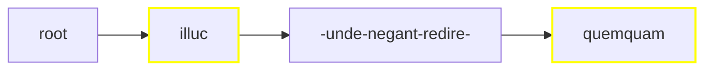
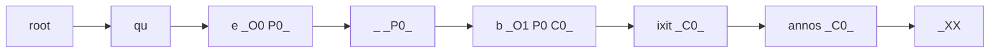

# Rendering Critical Text

Rendering a critical apparatus is especially complex because it involves many different rendition strategies according to the source data and the target format. Let us consider various scenarios, from the simplest to the most complex ones.

Before illustrating these examples, let us recap the standard [apparatus](https://github.com/vedph/cadmus-philology/blob/master/docs/fr.apparatus.md) fragment model:

- location
- tag
- entries:
  - subrange
  - tag
  - value
  - normValue
  - isAccepted
  - groupId
  - witnesses:
    - value
    - note
  - authors:
    - tag
    - value
    - location
    - note
  - note

The apparatus model essentially represents variants as edit operations on the base text. So, a variant like `illic` for the base text `illuc` is represented as a replacement operation (type=replacement). When instead we just want to add metadata, e.g. to list the witnesses for `illuc`, the lemma accepted in the reconstructed text, we use a note type. In this case the value is null (when it is an empty string, this is a zero variant, i.e. an omission or deletion).

## Linear Single Layer

- tree: linear.
- layers: single (=apparatus only).
- output: TEI with embedded `app`.

In this approach we have selected a _single_ layer, the apparatus. So, merging just projects the apparatus ranges on the whole text; the text is segmented only according to the apparatus fragments.

>Given that we deal with a single layer, we can be sure there is no overlap: this is a constraint imposed to the Cadmus text layers model. This constraint, somewhat artificial for the Cadmus model itself, was designed for compatibility reasons, to make it simpler to deal with third-party models in exports or visualizations.

Say we have this simple text:

```txt
012345678901234567890123456789012
illuc unde negant redire quemquam
AAAAA....................BBBBBBBB
```

Here we have 2 fragments in the apparatus layer part, one (A) with 3 entries, and another (B) with 2. For brevity I am quoting the fragments with A and B and their entries with their index (0, 1, etc.):

- A0:
  - note entry: witnesses=`O1`, accepted.
- A1:
  - replacement entry: value=`illud`, witnesses=`O G R`.
- A2:
  - replacement entry: value=`illic`, authors=`Fruterius` with note=`(†1566) 1605a 388`.
- B0:
  - note entry: witnesses=`O G`, accepted.
- B1:
  - replacement entry: value=`umquam`, witnesses=`R`, note=`some note`.

>To keep things simpler, in this example each fragment has a single entry, but we could well have many of them.

The merged ranges would be:

1. 0-4 for `illuc`: fragment ID=`it.vedph.token-text-layer:fr.it.vedph.apparatus@0`;
2. 25-32 for `quemquam`: fragment ID=`it.vedph.token-text-layer:fr.it.vedph.apparatus@1`.



>In this diagram, yellow borders mark nodes linked to apparatus fragments and dashes represent spaces.

At this stage, we're done with the tree and we can move to its rendering. Rendition depends on the desired output format; for this example, let's keep things simple and say that we want a TEI text fragment like this (witnesses and other attributes are fake data assumed to be in the fragments, and text is indented for more readability):

```xml
<p>
    <app n="1">
      <lem n="1" wit="#O1">illuc</lem>
      <rdg n="2" wit="#O #G #R">illud</rdg>
      <rdg n="3" xml:id="rdg1" resp="#Fruterius">illic</rdg>
      <witDetail target="#rdg1" resp="#Fruterius">(†1566) 1605a 388</witDetail>
    </app>
    unde negant redire
    <app n="2">
      <lem n="1" wit="#O #G">quemquam</lem>
      <rdg wit="#R">
        umquam
        <note>some note</note>
      </rdg>
    </app>
</p>
```

We can easily build this TEI code by just traversing our tree:

1. at root, start with a block element (`p` in this case);
2. `illuc`: as the node is linked to a fragment, add an `app` element and inside it add a `lem` element with the node's text as text, and as many `rdg` elements as variants with the variant value as text;
3. `unde negant redire` (surrounded by spaces) is not linked to fragments, so just output it as text;
4. `quemquam`: linked to fragment, so process as for 2 above;
5. close the block.

So the rules for this simple renderer would be:

- use a specific element for blocks (e.g. `p` for prose, `l` for verses):
  - open a block at root;
  - close and reopen the block after each node before a newline;
  - close the block at end.

- if the node has apparatus feature(s):
  - add an `app` element with content:
    - `lem` = node text with `@wit` for witnesses, `@resp` for authors, a child `note` for note. Also, for each witness/author having its own note, add a `witDetail` sibling with `@target` pointing to the witness/author element, `@wit` or `@resp` with the value of the author/witness, and content=note's value.
    - `rdg` = variant text, with attributes and children as above.
- else just output the node's text.

>As you can see from the example, the renderer also adds `@n` attributes with the ordinal numbers of fragments (rendered into `app` elements) and entries (rendered into `lem` or `rdg` elements).

## Linear Multiple Layers

- tree: linear.
- layers: multiple.
- output: standoff TEI, where a document contains the text and there are as many additional documents as layers.

Let us start from a 2-lines token-based text like this:

```txt
que bixit
annos XX
```

Let us say that there are the following layer fragments:

- O0: orthography fragment 0 on `qu[e]` (`1.1@3`).
- O1: orthography fragment 1 on `[b]ixit` (`1.2@1`).
- P0: paleography fragment 0 on `qu[e b]ixit` (a ligature: `1.1@3-1.2@1`).
- C0: comment fragment 0 on `bixit annos` (`1.2-2.1`).

This time we select all the layers for rendition and we opt for standoff TEI. Tthese are our layers:

```txt
012345678901234567
que bixit|annos XX
..O............... O0
....O............. O1
..PPP............. P0
....CCCCCCCCCCC... C0
```

From here we get these ranges (I am numbering the ranges to make it easier to refer to them in this documentation):

1. 0-1 for `qu` = no fragments;
2. 2-2 for `e` = O0, P0;
3. 3-3 for space = P0;
4. 4-4 for `b` = O1, P0, C0;
5. 5-14 for `ixit|annos` = C0;
6. 15-17 for space + `XX` = no fragments.

Here we have the text with indexes above, and range numbers below:

```txt
012345678901234567
que bixit|annos XX
112345555555555666
```

From ranges we get our tree, which is further filtered by a block linear tree text filter to properly handle newlines (see about [rendition stages](rendition#building-trees)):



In this diagram, I have added the abbreviations for the corresponding linked fragments to each node having them.

The first thing to notice is that, due to merging ranges from multiple layers, the segmentation often is no longer aligned with that of each single layer. For instance, the paleographic layer, whose unique fragment covered `e b` in `que bixit`, is now split across 3 text nodes: `e`, space, and `b`; and similarly happens for the comment layer (`b`, `ixit`, `annos`).

This implies that in a standoff notation we will need to refer to ranges of nodes, rather than to a single one. In other terms, a possible rendering for the base text would be like this (I am indenting code for better readability):

```xml
<p>
  qu
  <seg xml:id="seg1">e</seg>
  <seg xml:id="seg2"> </seg>
  <seg xml:id="seg3">b</seg>
  <seg xml:id="seg4">ixit</seg>
</p>
<p>
  <seg xml:id="seg5">annos</seg>
   XX
</p>
```

>Note that differently from usual standoff practices, where we define an a-priori granularity level for our annotations, like the "word", and then systematically wrap each word in some element like `seg`, here the granularity level is not set in advance; and wrapping text happens only when required. So, `qu` and space + `XX`, which are not linked to any annotation layer, are not wrapped in `seg`. Also, where used these elements wrap a variable span of text, from a single character to multiple words.

So, standoff notations would link to either a single element, using a `@loc` attribute, or to a range of elements, using a child `loc` element with attributes `@spanFrom` and `@spanTo`. For instance, in the case of P0 we would have a range starting from `#seg2` and ending with `#seg4`.

To get a similar output, our item composer would use:

- a text tree renderer which generates the above XML, segmented as per tree nodes, having a unique ID for each segment.
- 3 JSON renderers, one per layer, each generating its own document with annotations, variously linked to the base text segments.

While the text tree renderer can be implemented just once, JSON renderers may vary a lot depending not only on the source data type, but also on the desired output. The general architecture is flexible enough, because a TEI item composer just uses the text tree renderer sampled above, plus any number of JSON renderers. These get as input the JSON code representing a layer part, and output a string using any format, e.g. XML.

On the implementation side, for a specific input and output you could either use a specialized backend component, adding it to the configuration (and to the plugins, when it's not included in the default modules); or just use a more generic approach based on more accessible technologies, like XSLT.

For the latter option there is a specific JSON renderer, whose task is right to:

1. get a JSON input;
2. convert it into XML;
3. apply the received XSLT script to it;
4. emit the result as its output.
