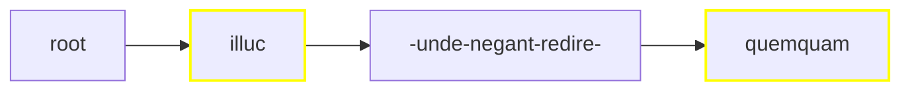
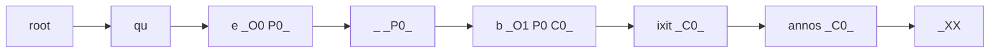

# Rendering Critical Text

Rendering a critical apparatus is especially complex because it involves many different rendition strategies according to the source data and the target format. Let us consider various scenarios, from the simplest to the most complex ones.

Before illustrating these examples, let us recap the standard [apparatus](https://github.com/vedph/cadmus-philology/blob/master/docs/fr.apparatus.md) fragment model:

- location
- tag
- entries:
  - subrange
  - tag
  - value
  - normValue
  - isAccepted
  - groupId
  - witnesses:
    - value
    - note
  - authors:
    - tag
    - value
    - location
    - note
  - note

The apparatus model essentially represents variants as _edit operations_ on the base text. So, a variant like `illic` for the base text `illuc` is represented as a replacement operation (type=replacement). When instead we just want to add metadata, e.g. to list the witnesses for `illuc`, the lemma accepted in the reconstructed text, we use a _note_ type. In this case the value is null (or empty). The variant value is null or empty also when it represents a zero variant, i.e. an omission or deletion; but in this case the type is _replacement_.

>In practice, this means that a user of the apparatus editor will create a _replacement_ or _insert-before_ or _insert-after_ entry to represent a variant, and a note entry to represent the variant accepted in the critical text. An omission or deletion is just a variant with value zero.

## Linear Single Layer

- tree: linear.
- layers: single (=apparatus only).
- output: TEI with embedded `app`.

In this approach we have selected a _single_ layer, the apparatus. So, merging just projects the apparatus ranges on the whole text; the text is segmented only according to the apparatus fragments.

>Given that we deal with a single layer, we can be sure there is no overlap: this is a constraint imposed to the Cadmus text layers model. This constraint, somewhat artificial for the Cadmus model itself, was designed for compatibility reasons, to make it simpler to deal with third-party models in exports or visualizations.

Say we have this simple text:

```txt
012345678901234567890123456789012
illuc unde negant redire quemquam
AAAAA....................BBBBBBBB
```

Here we have 2 fragments in the apparatus layer part, one (A) with 3 entries, and another (B) with 2. For brevity I am quoting the fragments with A and B and their entries with their index (0, 1, etc.):

- A0:
  - note entry: witnesses=`O1`, accepted.
- A1:
  - replacement entry: value=`illud`, witnesses=`O G R`.
- A2:
  - replacement entry: value=`illic`, authors=`Fruterius` with note=`(†1566) 1605a 388`.
- B0:
  - note entry: witnesses=`O G`, accepted.
- B1:
  - replacement entry: value=`umquam`, witnesses=`R`, note=`some note`.

>To keep things simpler, in this example each fragment has a single entry, but we could well have many of them.

The merged ranges would be:

1. 0-4 for `illuc`: fragment ID=`it.vedph.token-text-layer:fr.it.vedph.apparatus@0`;
2. 25-32 for `quemquam`: fragment ID=`it.vedph.token-text-layer:fr.it.vedph.apparatus@1`.



>In this diagram, yellow borders mark nodes linked to apparatus fragments and dashes represent spaces.

At this stage, we're done with the tree and we can move to its rendering. Rendition depends on the desired output format; for this example, let's keep things simple and say that we want a TEI text fragment like this (witnesses and other attributes are fake data assumed to be in the fragments, and text is indented for more readability):

```xml
<p>
    <app n="1">
      <lem n="1" wit="#O1">illuc</lem>
      <rdg n="2" wit="#O #G #R">illud</rdg>
      <rdg n="3" xml:id="rdg1" resp="#Fruterius">illic</rdg>
      <witDetail target="#rdg1" resp="#Fruterius">(†1566) 1605a 388</witDetail>
    </app>
    unde negant redire
    <app n="2">
      <lem n="1" wit="#O #G">quemquam</lem>
      <rdg wit="#R">
        umquam
        <note>some note</note>
      </rdg>
    </app>
</p>
```

We can easily build this TEI code by just traversing our tree:

1. at root, start with a block element (`p` in this case);
2. `illuc`: as the node is linked to a fragment, add an `app` element and inside it add a `lem` element with the node's text as text, and as many `rdg` elements as variants with the variant value as text;
3. `unde negant redire` (surrounded by spaces) is not linked to fragments, so just output it as text;
4. `quemquam`: linked to fragment, so process as for 2 above;
5. close the block.

So the rules for this simple renderer would be:

- use a specific element for blocks (e.g. `p` for prose, `l` for verses):
  - open a block at root;
  - close and reopen the block after each node before a newline;
  - close the block at end.

- if the node has apparatus feature(s):
  - add an `app` element with content:
    - `lem` = node text with `@wit` for witnesses, `@resp` for authors, a child `note` for note. Also, for each witness/author having its own note, add a `witDetail` sibling with `@target` pointing to the witness/author element, `@wit` or `@resp` with the value of the author/witness, and content=note's value.
    - `rdg` = variant text, with attributes and children as above.
- else just output the node's text.

>As you can see from the example, the renderer also adds `@n` attributes with the ordinal numbers of fragments (rendered into `app` elements) and entries (rendered into `lem` or `rdg` elements).

## Linear Multiple Layers

- tree: linear.
- layers: multiple.
- output: standoff TEI, where a document contains the text and there are as many additional documents as layers.

Introducing standoff poses the problem of defining identifiers for the portions of the base text other annotations will link to. This definition must depend on source data and produce a compact identifier with an idempotent function, to ensure that the same input parameters always generate the same output, whatever the number of times you use that function.

These features of our ID generation function (dependent on source and idempotent) ensure that we can generate the same ID when dealing with the same source data, even when in separate contexts. So, the component in charge of generating the base text will use the same function (and the same source data) as those generating the annotations linked to it; and this will ensure that they share a common system of identifiers.

Before introducing the standoff process of this example we must thus deal with this function.

### Standoff Linking

In standoff notation we need a system for linking each annotation with its target text. Linking relies on shared identifiers; so the problem is how we generate these identifiers.

In the context of the rendering process, there are many types of identifiers.

#### Fragment Identifiers

Fragment identifiers are used to link the portion of a text to one or more fragments in a layer part. As explained about the [rendition architecture](architecture#building-trees), the process converts the annotated text into a tree of text nodes, each linked to zero or more fragments (=annotations with a specific model).

The rendering system processes one item at a time; so, within the item's context, all what is required to identify each part is just the combination of the part's type and role IDs.

>By definition, each such combination in a Cadmus item is unique. That's why the role exists: it allows using the same part type more than once in each item.

So, within the item rendering process the link to each layer part's fragment is represented by an identifier with form `typeId:roleId@fragmentIndex`.

For instance, the first fragment (=index 0 in the fragments array of the layer part) of an orthography annotations layer part has ID `it.vedph.token-text-layer:fr.it.vedph.orthography@0`, which means:

1. part type = token-based text layer (type ID `it.vedph.token-text-layer`);
2. role = apparatus fragment (role ID `fr.it.vedph.orthography`);
3. fragment index = 0.

For instance, the word `e` of `que` in the [example](architecture#building-trees) about rendering architecture has a fragment ID equal to `it.vedph.token-text-layer:fr.it.vedph.orthography@0`, because it is linked to a single fragment (here the first one) from the orthography annotations layer.

This ID is unique only within the scope of the item being processed; in a typical text, you will have many items representing text with an apparatus layer, and each will have its first apparatus layer fragment identified by the same ID value.

This is not an issue until we stay within the boundaries of a single item, as it happens in this case. Having a type-based identifier here is convenient, because it allows the rendition process to pick the software module which is fit to each type of data model. Each part in Cadmus (just like each item) has its own globally unique identifier; but this is intentionally opaque, and does not tell anything about the model of the object identified by it. Using unique combinations based on types instead provides this data for immediate consumption by the rendering process.

So, fragment IDs are used only internally, and they never leave the item boundaries. They provide an efficient mechanism to link portions of texts to their annotations from any number of layers, and to select the appropriate renderer for each type.

#### Segment Identifiers

With _segment identifiers_ I mean identifiers associated to any portion of a base text in standoff notation, whatever the TEI element used to wrap this text. Often this is a `seg` (segment) element, whence this name, which is generic enough for this purpose.

Segment identifiers need to be unique within the document(s) generated by the rendering process. For instance, if the process generates a document for the base text and another one for its standoff apparatus annotations, any segment identifier is unique within both these documents, whatever the source item it comes from.

Any tree renderer or JSON renderer component in this architecture has access to the same source data, among which there are the item being rendered, and the tree generated from segmentation. We can thus build the identifier of each annotated portion of text (a segment) by combining:

1. the item's ID, which is a GUID.
2. the node's ID, which is an automatically assigned number, unique within the item's context. In the case of a linear tree, nodes usually just have an ordinal number: the first node after the root (which is blank) has 1; the second has 2; and so forth. Anyway, tree filters might add or remove nodes, so that it might well happen that the order of the resulting segments does not coincide with that of the numeric ID. This poses no issues, because this ID is just an opaque, meaningless identifier.

The segment ID thus gets the form `itemId/nodeId`, e.g. `db66b931-d468-4478-a6ae-d9e56e9431b9/it.vedph.token-text-layer:fr.it.vedph.apparatus@0`, where `db66b931-d468-4478-a6ae-d9e56e9431b9` is the item's ID. This uniquely identifies each text segment in the document, as it provides a globally unique identifier for it.

>The ID is globally unique because its prefix is a GUID. So this identifier is guaranteed to be unique even outside the boundaries of the generated documents.

So, both families of components involved in rendering standoff TEI would use the same mechanism for segment identifiers:

- the component in charge of generating the base text is a tree renderer.
- the component(s) in charge of generating annotations are JSON renderers.

Both these components have access to the source item and the corresponding text tree. The tree nodes correspond to segments, and each node has its ID and any number of fragment IDs pointing to annotations. So, given the same input, we expect the same output ID for each segment.

#### Mapping Identifiers

Anyway, in a TEI output we would not like such long identifiers for text fragments. We need something more compact, like a simple number as customary in TEI practice, to avoid hindering XML code readability.

Of course a simple number would not be globally unique like a GUID; but it's unique within the boundaries of all the documents generated by the rendition process, and that's enough.

For this number we must take into account a couple of considerations:

- we will add some prefix to this number, because XML does not allow identifiers starting with a digit.
- we are not going to have a totally opaque number here. We prefer to use many sets of numeric identifiers, each targeting a specific type of output, whatever its input. For instance, in a TEI document we could use a set of numbers to target elements of type `seg`, and a different set to target elements of type `lem`. This makes the generated code more interpretable, and also avoids too large numbers.

The mapping logic is implemented with a generic mechanism in the _rendering context_, a data object shared among all the components taking part in the rendition process. Whenever a component has a unique ID it wants to map into a compact numeric ID with a prefix, it just asks the context for it, providing:

- the category of the identifier, usually derived from the target element's local name. For instance, when the link targets a `seg` element, the category is `seg`. This means that for each emitted `seg` requiring a link, this will get a unique numeric ID (unique in the context of the document(s) emitted in rendering), progressively generated, with its category prefix, like `seg1`, `seg2`, etc.
- the source unique ID to be mapped. This can be anything, provided that it is unique within the context of the generated documents. In most cases it will just be a segment ID.

This mapping can be applied _during_ the tree processing, or _after_ this has been done. The former is the case of standoff components: a standoff base text component and a standoff apparatus layer JSON renderer. These are backend components with their own complex logic. The latter is the case of outsourced rendition.

In fact, most renderers use a more affordable processing based on XSLT, because most TEI users are well acquainted to this technology, and this allows a high degree of customization for configuring rendition in a simple text: you just provide your own XSLT code as a configuration parameter, which is applied in the context of the bigger flow of Cadmus rendering.

In this case, we are "outsourcing" the rendition logic to the XSLT processor: it just gets the JSON code representing a data object, and blindly produces a string-based output. There is no rendering context here, nor any access to the source database or to the generated text tree. The only input is:

- the XML being transformed, which in turn is the product of previous rendering stages.
- the JSON representing the data to render (essentially, the serialization of a Cadmus part, whether it's a layer or not).

So, we can get source identifiers from our XML, assuming that the previous rendering stages output them: for instance, by convention each block of text output from an item carries a `@source` attribute with a value starting with `$` followed by the item's ID (a GUID). This ensures that the XSLT processor has access to the source item's ID.

As for mapping these source identifiers instead, the XSLT script has no clues; and this is desired, because it is right this isolation which guarantees the system's modularity. Also, this frees the XSLT logic from the burden of this task, which is beyond its technical capabilities. So, the XSLT script just emits source identifiers; later, a filter will be used to map these identifiers and replace the original ones. So, this is a _delayed mapping_, which still ends with the same result: the output will have only compact, mapped identifiers.

>The filter used to map identifiers is the source IDs renderer filter. This filter replaces all the source identifiers delimited between a specified pair of opening and closing tags (by default `#[...#]`) with the corresponding mapped identifiers got from the rendering context. For instance, a segment source ID with form `seg/itemId/nodeId` is mapped to a target ID like `seg123`. This assumes that the source ID is prefixed by the mapped ID category name (e.g. `seg` for segments), followed by a slash.

### Standoff Procedure

Let us start from a 2-lines token-based text like this:

```txt
que bixit
annos XX
```

Let us say that there are the following layer fragments:

- O0: orthography fragment 0 on `qu[e]` (`1.1@3`).
- O1: orthography fragment 1 on `[b]ixit` (`1.2@1`).
- P0: paleography fragment 0 on `qu[e b]ixit` (a ligature: `1.1@3-1.2@1`).
- C0: comment fragment 0 on `bixit annos` (`1.2-2.1`).

This time we select all the layers for rendition and we opt for standoff TEI. Tthese are our layers:

```txt
012345678901234567
que bixit|annos XX
..O............... O0
....O............. O1
..PPP............. P0
....CCCCCCCCCCC... C0
```

From here we get these ranges (I am numbering the ranges to make it easier to refer to them in this documentation):

1. 0-1 for `qu` = no fragments;
2. 2-2 for `e` = O0, P0;
3. 3-3 for space = P0;
4. 4-4 for `b` = O1, P0, C0;
5. 5-14 for `ixit|annos` = C0;
6. 15-17 for space + `XX` = no fragments.

Here we have the text with indexes above, and range numbers below:

```txt
012345678901234567
que bixit|annos XX
112345555555555666
```

From ranges we get our tree, which is further filtered by a block linear tree text filter to properly handle newlines (see about [rendition stages](architecture#building-trees)):



In this diagram, I have added the abbreviations for the corresponding linked fragments to each node having them.

The first thing to notice is that, due to merging ranges from multiple layers, the segmentation often is no longer aligned with that of each single layer. For instance, the paleographic layer, whose unique fragment covered `e b` in `que bixit`, is now split across 3 text nodes: `e`, space, and `b`; and similarly happens for the comment layer (`b`, `ixit`, `annos`).

This implies that in a standoff notation we will need to refer to ranges of nodes, rather than to a single one. In other terms, a possible rendering for the base text would be like this (I am indenting code for better readability):

```xml
<p>
  qu
  <seg xml:id="seg1">e</seg>
  <seg xml:id="seg2"> </seg>
  <seg xml:id="seg3">b</seg>
  <seg xml:id="seg4">ixit</seg>
</p>
<p>
  <seg xml:id="seg5">annos</seg>
   XX
</p>
```

>Note that differently from usual standoff practices, where we define an a-priori granularity level for our annotations, like the "word", and then systematically wrap each word in some element like `seg`, here the granularity level is not set in advance; and wrapping text happens only when required. So, `qu` and space + `XX`, which are not linked to any annotation layer, are not wrapped in `seg`. Also, where used these elements wrap a variable span of text, from a single character to multiple words.

So, standoff notations would link to either a single element, using a `@loc` attribute, or to a range of elements, using a child `loc` element with attributes `@spanFrom` and `@spanTo`. For instance, in the case of P0 we would have a range starting from `#seg2` and ending with `#seg4`.

To get a similar output, our item composer would use:

- a text tree renderer which generates the above XML, segmented as per tree nodes, having a unique ID for each segment.
- 3 JSON renderers, one per layer, each generating its own document with annotations, variously linked to the base text segments.

While the text tree renderer can be implemented just once, JSON renderers may vary a lot depending not only on the source data type, but also on the desired output. The general architecture is flexible enough, because a TEI item composer just uses the text tree renderer sampled above, plus any number of JSON renderers. These get as input the JSON code representing a layer part, and output a string using any format, e.g. XML.

On the implementation side, for a specific input and output you could either use a specialized backend component, adding it to the configuration (and to the plugins, when it's not included in the default modules); or just use a more generic approach based on more accessible technologies, like XSLT.

For the latter option there is a specific JSON renderer, whose task is right to:

1. get a JSON input;
2. convert it into XML;
3. apply the received XSLT script to it;
4. emit the result as its output.

This allows to use a simpler transformation in the context of the rendition system, which provides additional logic. In this approach, this logic is deferred after the XSLT based transformation by using filters. For instance, the link to a base text segment of text in standoff requires the logic for converting a type-based identifier into a compact, globally unique identifier, which in turn requires access to the database. This can't be conveniently done in the XSLT script, so this just emits the type-based identifiers, letting a filter resolve them later.
