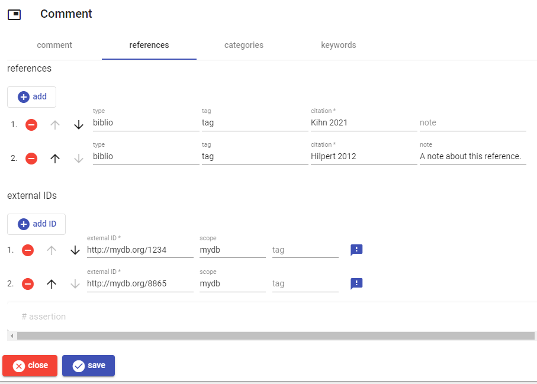
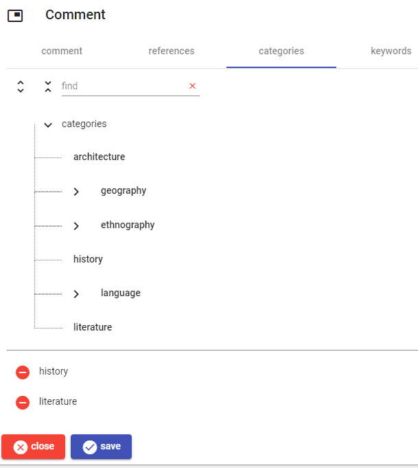
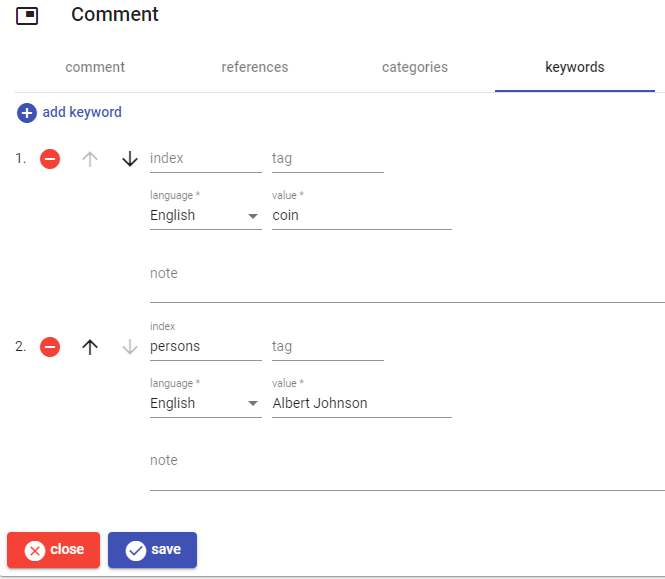
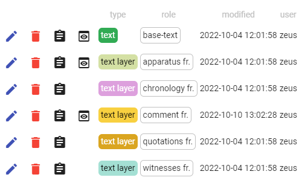
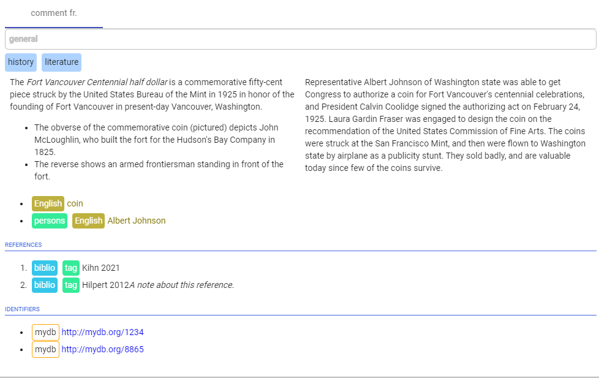

# JSON Rendering and Other Techs

Any Cadmus object, either part or fragment, is ultimately archived as JSON. So, JSON is the starting point when rendering the output.

Although you can use any [JSON renderer component](components/json-renderers), in most cases, unless more complex logic is required, you can use the XSLT JSON renderer. This component was designed right to provide the frendliest environment for rendering an output starting from any Cadmus object.

As a matter of fact, most users are accustomed to XSLT as a way of producing an HTML output from a (TEI) XML document. XSLT, though not ideal, is thus a highly popular and well-known standard which usually provides enough power to transform the input semantic markup (XML) into a presentational markup (HTML).

Thus, the JSON renderer which will probably used the most relies right on XSLT. Of course, XSLT is a sister technology of XML, and is designed to transform XML input. Yet, here we have JSON. So, to fill the gap this renderer can automatically convert JSON into XML, and then apply a user-provided XSLT to it.

Yet, it may well happen that some transformations (e.g. data selection or projection) are best performed in the context of a JSON-based model, rather than in the XML DOM. After all, JSON is a serialization format for objects, and we might well need to access their structure when transforming it.

So, this renderer not only provides XSLT-based transformation, but also JSON-based transformation. This is accomplished by using [JMESPath](https://jmespath.org/tutorial.html), a powerful selection and transformation language for JSON.

The renderer can thus apply both JSON-based transformations and an XSLT script to the source object; or just any of them.

Additionally, we might also want to adjust the resulting output in some special ways, using logic which can be shared among different renderers. There is a number of tasks which are best located here, just after the renderer transforms, and before returning their result. The [renderer filters](components/renderer-filters) are in charge of these tasks.

So, this JSON renderer has a number of requirements:

- it should be fully customizable by users, who are accustomed to XSLT transformations. We must then adapt our JSON data to XML, so that it can be processed via XSLT.
- it should provide a powerful way for transforming JSON data even before submitting it to the XSLT processor. This refers to a true JSON transform, rather than a raw string-based transform, just like XSLT implies a DOM rather than just working on a sequence of characters.
- both the JSON and the XML transformation should be available in any combination: JSON only, XML only, JSON + XML.
- it should be able to convert Markdown text.
- it should be able to lookup thesauri.

To this end we leverage these technologies:

- [JMESPath](https://jmespath.org/tutorial.html).
- an automatic [conversion](https://www.newtonsoft.com/json/help/html/ConvertingJSONandXML.htm) from JSON to XML.
- XSLT for transforming XML.
- [Markdig](https://github.com/xoofx/markdig) to optionally convert Markdown regions into HTML/plain text.

[Thesaurus lookup](components/renderer-filters#thesaurus) and [Markdown conversion](components/renderer-filters#markdown) are provided via filters.

Even though this implies more processing stages, it represents a highly customizable component where most users will be at home, as XSLT is a popular and easy way of processing XML for output. Yet, optionally the additional processing power of a specific JSON transformation engine can be leveraged to prepare the data before converting them into XSLT. It might also be the case that there is no XSLT, and the output is directly generated by JMESPath transforms: in this case no conversion from JSON to XML will occur.

## Simple Example

As a sample, say we have this token-based text part, representing the text `que bixit / annos XX`:

```json
{
  "citation": "CIL 1,23",
  "lines": [
    { "y": 1, "text": "que bixit" },
    { "y": 2, "text": "annos XX" }
  ],
  "id": "9a801c84-0c93-4074-b071-9f4f9885ba66",
  "itemId": "item",
  "typeId": "it.vedph.token-text",
  "roleId": "base-text",
  "thesaurusScope": null,
  "timeCreated": "2022-08-07T14:04:01.3995195Z",
  "creatorId": "zeus",
  "timeModified": "2022-08-07T14:04:01.3995195Z",
  "userId": "zeus"
}
```

The model for this part (apart from the usual metadata) just contains a _citation_, which can use any type of citational scheme for a text, and a _text_, consisting of any number of lines.

When handling it in an `XsltJsonRenderer` configured for a single XSLT-based transformation, first the JSON code is automatically wrapped in a `root` element by the renderer itself, to ensure it is well-formed for XML conversion, whence:

```json
{
  "root": {
    "citation": "CIL 1,23",
    "lines": [
      { "y": 1, "text": "que bixit" },
      { "y": 2, "text": "annos XX" }
    ],
    "id": "9a801c84-0c93-4074-b071-9f4f9885ba66",
    "itemId": "item",
    "typeId": "it.vedph.token-text",
    "roleId": "base-text",
    "thesaurusScope": null,
    "timeCreated": "2022-08-07T14:04:01.3995195Z",
    "creatorId": "zeus",
    "timeModified": "2022-08-07T14:04:01.3995195Z",
    "userId": "zeus"
  }
}
```

Then, JSON is converted into XML:

```xml
<root><citation>CIL 1,23</citation><lines><y>1</y><text>que bixit</text></lines><lines><y>2</y><text>annos XX</text></lines><id>9a801c84-0c93-4074-b071-9f4f9885ba66</id><itemId>item</itemId><typeId>it.vedph.token-text</typeId><roleId>base-text</roleId><thesaurusScope /><timeCreated>2022-08-07T14:12:44.8640749Z</timeCreated><creatorId>zeus</creatorId><timeModified>2022-08-07T14:12:44.8640749Z</timeModified><userId>zeus</userId></root>
```

>To get the XML corresponding to each part's (or item's) JSON you can use the [Cadmus CLI tool](https://github.com/vedph/cadmus_tool).

At this stage, the XSLT transformation occurs. In this example, it's a simple transform to produce a plain text output:

```xml
<?xml version="1.0" encoding="UTF-8"?>
<xsl:stylesheet xmlns:xsl="http://www.w3.org/1999/XSL/Transform" xmlns:tei="http://www.tei-c.org/ns/1.0" version="1.0">
  <xsl:output method="text" encoding="UTF-8"/>
  <xsl:strip-space elements="*" />

  <xsl:template match="citation">[<xsl:value-of select="."/>]<xsl:text xml:space="preserve">&#xA;</xsl:text>
</xsl:template>

  <xsl:template match="lines">
    <xsl:value-of select="y"/>
    <xsl:text xml:space="preserve">  </xsl:text>
    <xsl:value-of select="text"/>
    <xsl:text xml:space="preserve">&#xA;</xsl:text>
  </xsl:template>

  <xsl:template match="root">
    <xsl:apply-templates/>
  </xsl:template>

  <xsl:template match="*"></xsl:template>
</xsl:stylesheet>
```

So, the final output is:

```txt
[CIL 1,23]
1  que bixit
2  annos XX
```

Of course, that's just a trivial example, but it should be enough to show the power of this multi-technology approach to JSON rendering. In real-world, the Cadmus editor will use HTML output, thus providing a highly structured presentational markup as the rendition for any part.

## Real World Example

To better illustrate this point, here is a more realistic sample.

Say you have this comments layer part. You enter its data via the comment fragment editor, as shown in the following screenshots:


- _The comment editor with Markdown text and a tag named "general"._



- _The comment editor references. There are two bibliographic references, and two external identifiers._



- _The comment editor categories. Categories are listed in a hierarchy, displayed as a tree. Here we have picked a couple of categories (history and literature)._



- _The comment editor keywords. There are a couple of English keywords, one related to a specific index (persons)._

The corresponding JSON code representing this comment layer part follows (limited to a single comment fragment for brevity):

```json
{
  "_id": "988a47cf-47f9-4678-bf5a-27221cc23c56",
  "itemId": "b2271044-32e5-4b6e-b643-cfd925bbdda0",
  "typeId": "it.vedph.token-text-layer",
  "roleId": "fr.it.vedph.comment",
  "thesaurusScope": null,
  "content": {
    "fragments": [
      {
        "location": "7.1",
        "tag": "general",
        "text": "Hic dolores quo.",
        "references": [
          {
            "type": "biblio",
            "tag": "tag",
            "citation": "Nienow 2013",
            "note": "Quod reprehenderit et libero quia ut."
          }
        ],
        "externalIds": [
          {
            "assertion": null,
            "tag": null,
            "value": "JBOD",
            "scope": "mydb"
          },
          {
            "assertion": null,
            "tag": null,
            "value": "SQL",
            "scope": "mydb"
          }
        ],
        "categories": ["language.syntax"],
        "keywords": [
          {
            "indexId": "ixb",
            "note": null,
            "tag": null,
            "language": "ita",
            "value": "a"
          },
          {
            "indexId": "ixa",
            "note": null,
            "tag": null,
            "language": "eng",
            "value": "perferendis"
          }
        ]
      },
      {
        "location": "4.8",
        "tag": "general",
        "text": "The *Fort Vancouver Centennial half dollar* is a commemorative fifty-cent piece struck by the United States Bureau of the Mint in 1925 in honor of the founding of Fort Vancouver in present-day Vancouver, Washington.\r\n\r\n- The obverse of the commemorative coin (pictured) depicts John McLoughlin, who built the fort for the Hudson's Bay Company in 1825.\r\n- The reverse shows an armed frontiersman standing in front of the fort.\r\n\r\nRepresentative Albert Johnson of Washington state was able to get Congress to authorize a coin for Fort Vancouver's centennial celebrations, and President Calvin Coolidge signed the authorizing act on February 24, 1925. Laura Gardin Fraser was engaged to design the coin on the recommendation of the United States Commission of Fine Arts. The coins were struck at the San Francisco Mint, and then were flown to Washington state by airplane as a publicity stunt. They sold badly, and are valuable today since few of the coins survive.",
        "references": [
          {
            "type": "biblio",
            "tag": "tag",
            "citation": "Kihn 2021",
            "note": ""
          },
          {
            "type": "biblio",
            "tag": "tag",
            "citation": "Hilpert 2012",
            "note": "A note about this reference."
          }
        ],
        "externalIds": [
          {
            "assertion": null,
            "tag": null,
            "value": "http://mydb.org/1234",
            "scope": "mydb"
          },
          {
            "assertion": null,
            "tag": null,
            "value": "http://mydb.org/8865",
            "scope": "mydb"
          }
        ],
        "categories": ["history", "literature"],
        "keywords": [
          {
            "indexId": "",
            "note": null,
            "tag": null,
            "language": "eng",
            "value": "coin"
          },
          {
            "indexId": "persons",
            "note": null,
            "tag": null,
            "language": "eng",
            "value": "Albert Johnson"
          }
        ]
      }
    ],
    "id": "988a47cf-47f9-4678-bf5a-27221cc23c56",
    "itemId": "b2271044-32e5-4b6e-b643-cfd925bbdda0",
    "typeId": "it.vedph.token-text-layer",
    "roleId": "fr.it.vedph.comment",
    "thesaurusScope": null,
    "timeCreated": "2022-10-04T10:01:58.28Z",
    "creatorId": "zeus",
    "timeModified": "2022-10-10T11:02:28.7506614Z",
    "userId": "zeus"
  },
  "timeCreated": "2022-10-04T10:01:58.280+0000",
  "creatorId": "zeus",
  "timeModified": "2022-10-10T11:02:28.750+0000",
  "userId": "zeus"
}
```

Now, when viewing this comment part in the item, the editor finds a suitable previewer for its type, and thus a preview button appears next to it. The same happens for a couple of other part types (base text and critical apparatus):



When clicking on this button, you get to the layer preview. This shows the text with green hilights for each portion of the text which is linked to a comment fragment in the comments layer part. By clicking on any of these portions, the previewer generates the corresponding output which is shown below the text:



- _Previewing a comment's fragment (for `provident`)._

As you can see, the comment preview here presents all the information found in the comment part, in a more compact and user-friendly way:

- at the top `general` is the comment's tag.
- below it, its two categories are shown.
- the comment's text has been rendered from Markdown, and shown in a couple of columns (the actual number depends on the width of the browser's window).
- under the text, its keywords are listed with their language and optional container index.
- below the text, references are listed with their type and tag, and eventual notes.
- finally, identifiers are listed with their scope. As these IDs happen to begin with `http`, they are rendered as clickable links.

Here is the configuration used for getting this preview:

```json
{
  "RendererFilters": [
    {
      "Keys": "markdown",
      "Id": "it.vedph.renderer-filter.markdown",
      "Options": {
        "MarkdownOpen": "<_md>",
        "MarkdownClose": "</_md>",
        "Format": "html"
      }
    },
    {
      "Keys": "iso639-3",
      "Id": "it.vedph.renderer-filter.iso639"
    }
  ],
  "JsonRenderers": [
    {
      "Keys": "it.vedph.token-text-layer|fr.it.vedph.comment",
      "Id": "it.vedph.json-renderer.xslt",
      "Options": {
        "WrappedEntryNames": {
          "categories": "category",
          "references": "reference",
          "keywords": "keyword",
          "externalIds": "externalId"
        },
        "Xslt": "<?xml version=\"1.0\" encoding=\"UTF-8\"?><xsl:stylesheet xmlns:xsl=\"http://www.w3.org/1999/XSL/Transform\" xmlns:xs=\"http://www.w3.org/2001/XMLSchema\" exclude-result-prefixes=\"xs\" version=\"1.0\"><xsl:output media-type=\"text/html\" method=\"html\" omit-xml-declaration=\"yes\" encoding=\"UTF-8\"/><xsl:template match=\"*[not(*) and not(normalize-space())]\"></xsl:template><xsl:template name=\"build-link\"><xsl:param name=\"val\"/><xsl:choose><xsl:when test=\"starts-with($val, 'http')\"><xsl:element name=\"a\"><xsl:attribute name=\"href\"><xsl:value-of select=\"$val\"/></xsl:attribute><xsl:attribute name=\"target\">_blank</xsl:attribute><xsl:value-of select=\"$val\"/></xsl:element></xsl:when><xsl:otherwise><xsl:value-of select=\"$val\"/></xsl:otherwise></xsl:choose></xsl:template><xsl:template match=\"reference\"><li><xsl:if test=\"type[normalize-space(.)]\"><span class=\"comment-ref-y\"><xsl:value-of select=\"type\"/></span></xsl:if><xsl:if test=\"tag[normalize-space(.)]\"><span class=\"comment-ref-t\"><xsl:value-of select=\"tag\"/></span></xsl:if><xsl:if test=\"citation\"><span class=\"comment-ref-c\"><xsl:call-template name=\"build-link\"><xsl:with-param name=\"val\" select=\"citation\"></xsl:with-param></xsl:call-template></span></xsl:if><xsl:if test=\"note[normalize-space(.)]\"><xsl:text></xsl:text><span class=\"comment-ref-n\"><xsl:value-of select=\"note\"/></span></xsl:if></li></xsl:template><xsl:template match=\"root\"><div class=\"comment\"><xsl:if test=\"tag[normalize-space(.)]\"><div class=\"comment-tag\"><xsl:value-of select=\"tag\"/></div></xsl:if><xsl:if test=\"categories/category\"><div class=\"pv-flex-row comment-categories\"><xsl:for-each select=\"categories/category\"><div class=\"comment-category\"><xsl:value-of select=\".\"/></div></xsl:for-each></div></xsl:if><xsl:if test=\"text\"><div class=\"comment-text\"><_md><xsl:value-of select=\"text\"/></_md></div></xsl:if><xsl:if test=\"keywords/keyword\"><ul class=\"comment-keywords\"><xsl:for-each select=\"keywords/keyword\"><xsl:sort select=\"indexId\"/><xsl:sort select=\"language\"/><xsl:sort select=\"value\"/><li><xsl:if test=\"indexId[normalize-space(.)]\"><span class=\"comment-kw-x\"><xsl:value-of select=\"indexId\"/></span></xsl:if><span class=\"comment-kw-l\">^^<xsl:value-of select=\"language\"/></span><span class=\"comment-kw-v\"><xsl:value-of select=\"value\"/></span></li></xsl:for-each></ul></xsl:if><xsl:if test=\"references/*\"><div class=\"comment-hdr\">references</div><ol class=\"comment-references\"><xsl:apply-templates select=\"references/reference\"/></ol></xsl:if><xsl:if test=\"externalIds/*\"><div class=\"comment-hdr\">identifiers</div><ul class=\"comment-ids\"><xsl:for-each select=\"externalIds/externalId\"><li><xsl:if test=\"tag[normalize-space(.)]\"><span class=\"comment-id-t\"><xsl:value-of select=\"tag\"/></span></xsl:if><xsl:if test=\"scope[normalize-space(.)]\"><span class=\"comment-id-s\"><xsl:value-of select=\"scope\"/></span></xsl:if><span class=\"comment-id-v\"><xsl:call-template name=\"build-link\"><xsl:with-param name=\"val\" select=\"value\"/></xsl:call-template></span><xsl:if test=\"assertion/*\"><div class=\"comment-assertion\"><xsl:if test=\"assertion/tag\"><span class=\"comment-id-t\"><xsl:value-of select=\"assertion/tag\"/></span></xsl:if><xsl:if test=\"assertion/rank\"><xsl:text></xsl:text><span class=\"comment-id-r\">R<xsl:value-of select=\"assertion/rank\"/></span></xsl:if><xsl:if test=\"assertion/note\"><xsl:text></xsl:text><div class=\"comment-id-n\"><xsl:value-of select=\"assertion/note\"/></div></xsl:if><xsl:if test=\"assertion/references\"><ol class=\"comment-assertion-refs\"><xsl:apply-templates select=\"assertion/references/reference\"/></ol></xsl:if></div></xsl:if></li></xsl:for-each></ul></xsl:if></div></xsl:template><xsl:template match=\"*\"/></xsl:stylesheet>",
        "FilterKeys": ["markdown", "iso639-3"]
      }
    }
  ],
  "TextPartFlatteners": [
    {
      "Keys": "it.vedph.token-text",
      "Id": "it.vedph.text-flattener.token"
    }
  ]
}
```

The rendition happens via an [XSLT-based JSON renderer](renderers.md#xslt-json-renderer). This is configured to wrap a number of entries into a parent element representing the original arrays in the JSON code (`WrappedEntryNames`), and to use a couple of filters:

- a [Markdown filter](filters#markdown-conversion-filter), which renders Markdown text into HTML. In fact, as you can observe from the above screenshot, the preview shows some text in italic, and a couple of paragraphs as a bulleted list. This is the effect of rendering Markdown.
- an [ISO 639 language code filter](filters#iso-639-lookup-filter), which converts ISO639-3 letters codes representing languages into their corresponding English name. In fact, instead of getting `eng` for keyword codes, which is the value stored in the database part, you get `English` by virtue of this filter.

This is the XSLT code extracted from the above JSON for better readability:

```xml
<?xml version="1.0" encoding="UTF-8"?>
<xsl:stylesheet xmlns:xsl="http://www.w3.org/1999/XSL/Transform"
    xmlns:xs="http://www.w3.org/2001/XMLSchema" exclude-result-prefixes="xs" version="1.0">
    <xsl:output media-type="text/html" method="html" omit-xml-declaration="yes" encoding="UTF-8"/>
    <xsl:template match="*[not(*) and not(normalize-space())]"></xsl:template>
    <xsl:template name="build-link">
        <xsl:param name="val"/>
        <xsl:choose>
            <xsl:when test="starts-with($val, 'http')">
                <xsl:element name="a">
                    <xsl:attribute name="href">
                        <xsl:value-of select="$val"/>
                    </xsl:attribute>
                    <xsl:attribute name="target">_blank</xsl:attribute>
                    <xsl:value-of select="$val"/>
                </xsl:element>
            </xsl:when>
            <xsl:otherwise>
                <xsl:value-of select="$val"/>
            </xsl:otherwise>
        </xsl:choose>
    </xsl:template>
    <xsl:template match="reference">
        <li>
            <xsl:if test="type[normalize-space(.)]">
                <span class="comment-ref-y">
                    <xsl:value-of select="type"/>
                </span>
            </xsl:if>
            <xsl:if test="tag[normalize-space(.)]">
                <span class="comment-ref-t">
                    <xsl:value-of select="tag"/>
                </span>
            </xsl:if>
            <xsl:if test="citation">
                <span class="comment-ref-c">
                    <xsl:call-template name="build-link">
                        <xsl:with-param name="val" select="citation"></xsl:with-param>
                    </xsl:call-template>
                </span>
            </xsl:if>
            <xsl:if test="note[normalize-space(.)]">
                <xsl:text></xsl:text>
                <span class="comment-ref-n">
                    <xsl:value-of select="note"/>
                </span>
            </xsl:if>
        </li>
    </xsl:template>
    <xsl:template match="root">
        <div class="comment">
            <xsl:if test="tag[normalize-space(.)]">
                <div class="comment-tag">
                    <xsl:value-of select="tag"/>
                </div>
            </xsl:if>
            <xsl:if test="categories/category">
                <div class="pv-flex-row comment-categories">
                    <xsl:for-each select="categories/category">
                        <div class="comment-category">
                            <xsl:value-of select="."/>
                        </div>
                    </xsl:for-each>
                </div>
            </xsl:if>
            <xsl:if test="text">
                <div class="comment-text">
                    <_md>
                        <xsl:value-of select="text"/>
                    </_md>
                </div>
            </xsl:if>
            <xsl:if test="keywords/keyword">
                <ul class="comment-keywords">
                    <xsl:for-each select="keywords/keyword">
                        <xsl:sort select="indexId"/>
                        <xsl:sort select="language"/>
                        <xsl:sort select="value"/>
                        <li>
                            <xsl:if test="indexId[normalize-space(.)]">
                                <span class="comment-kw-x">
                                    <xsl:value-of select="indexId"/>
                                </span>
                            </xsl:if>
                            <span class="comment-kw-l">^^<xsl:value-of select="language"/>
                            </span>
                            <span class="comment-kw-v">
                                <xsl:value-of select="value"/>
                            </span>
                        </li>
                    </xsl:for-each>
                </ul>
            </xsl:if>
            <xsl:if test="references/*">
                <div class="comment-hdr">references</div>
                <ol class="comment-references">
                    <xsl:apply-templates select="references/reference"/>
                </ol>
            </xsl:if>
            <xsl:if test="externalIds/*">
                <div class="comment-hdr">identifiers</div>
                <ul class="comment-ids">
                    <xsl:for-each select="externalIds/externalId">
                        <li>
                            <xsl:if test="tag[normalize-space(.)]">
                                <span class="comment-id-t">
                                    <xsl:value-of select="tag"/>
                                </span>
                            </xsl:if>
                            <xsl:if test="scope[normalize-space(.)]">
                                <span class="comment-id-s">
                                    <xsl:value-of select="scope"/>
                                </span>
                            </xsl:if>
                            <span class="comment-id-v">
                                <xsl:call-template name="build-link">
                                    <xsl:with-param name="val" select="value"/>
                                </xsl:call-template>
                            </span>
                            <xsl:if test="assertion/*">
                                <div class="comment-assertion">
                                    <xsl:if test="assertion/tag">
                                        <span class="comment-id-t">
                                            <xsl:value-of select="assertion/tag"/>
                                        </span>
                                    </xsl:if>
                                    <xsl:if test="assertion/rank">
                                        <xsl:text></xsl:text>
                                        <span class="comment-id-r">R<xsl:value-of select="assertion/rank"/>
                                        </span>
                                    </xsl:if>
                                    <xsl:if test="assertion/note">
                                        <xsl:text></xsl:text>
                                        <div class="comment-id-n">
                                            <xsl:value-of select="assertion/note"/>
                                        </div>
                                    </xsl:if>
                                    <xsl:if test="assertion/references">
                                        <ol class="comment-assertion-refs">
                                            <xsl:apply-templates select="assertion/references/reference"/>
                                        </ol>
                                    </xsl:if>
                                </div>
                            </xsl:if>
                        </li>
                    </xsl:for-each>
                </ul>
            </xsl:if>
        </div>
    </xsl:template>
    <xsl:template match="*"/>
</xsl:stylesheet>
```
