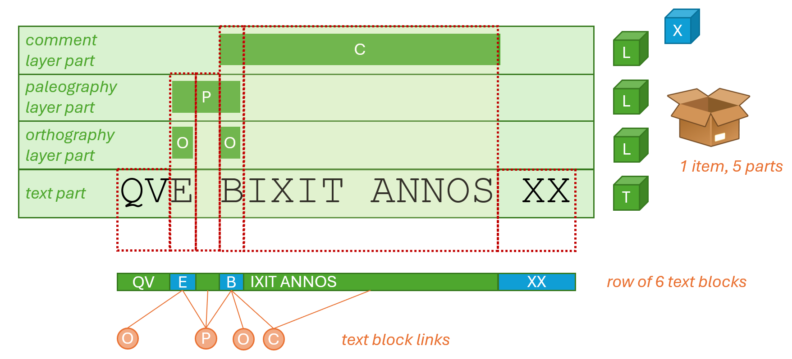

# Rendering Markup

- [Rendering Markup](#rendering-markup)
  - [Stand-off Notation](#stand-off-notation)
  - [Cadmus Approach to TEI Generation](#cadmus-approach-to-tei-generation)

## Stand-off Notation

The components used to export Cadmus data into some markup language (typically XML) are grouped under `Cadmus.Export.ML` assembly. These rely on the general purpose export components, and add logic targeted to build a full-fledged output for third parties (e.g. TEI).

In general, the simplest approach to building TEI from Cadmus objects is via some form of stand-off notation (see e.g. [E. Spadini, M. Turska, XML-TEI Stand-off Markup: One Step Beyond, Digital Philology 2019 225-239](https://serval.unil.ch/resource/serval:BIB_F671BA825955.P001/REF.pdf)). In fact, stand-off practically is the unique solution to solve serious overlap issues in TEI, typically arising when a lot of different structures are to be encoded in the same text.

In stand-off, annotations are no more embedded in the text, but rather stand side by side to it, and refer to it in various ways. The simplest and probably most popular linking method is just wrapping each portion of text to be annotated with an identifier. For instance, you can just wrap each word in the text in a `seg` element with some `xml:id`, and then refer to it from annotations.

Thus, stand-off implies that you have separated "layers" for:

- the text.
- every layer of annotations referring to the text.

This structure is most compatible with the Cadmus architecture, which is object-based. There, a text is just a set of text items, each representing a portion of it (just like several `div`'s encode the portions of a text in TEI). Every text item has a text part, with the text only, and any number of layer parts, each with its own model. Layer parts are linked to the text part via a coordinates system, so that, differently from TEI, adding layers does not require touching the text part in any way. Of course, this loose coupling is part of the Cadmus strategy for isolating and reusing content.

So, in Cadmus we start from a set of text items, having one text part and many text layer parts. In TEI this gets translated into a TEI document with the text only, and one TEI document for each layer part. These "layer" documents are linked to the text document via IDs annotated in the text document itself.

In this approach, we are not required to split the text document into a predefined level of granularity. This is usually required in TEI stand-off, as you have to provide a text before annotating it. For instance, if you are going to annotate graphical words, and nothing below this level, you will just mechanically wrap each sequence of characters delimited by whitespace into a `seg` or other similar element, assigning to each a unique ID, like a progressive number, like this (Catull. 2,1):

```xml
<l><w xml:id="w1">passer</w>, <w xml:id="w2">deliciae</w> <w xml:id="w3">meae</w> <w xml:id="w4">puellae</w></l>
```

This is of course _redundant_, as not all the `w` elements (and their IDs) will be effectively used as target of linked annotations; but you need to systematically wrap all the words, as you can't know in advance which words will be annotated.

Also, and more important, this limits the annotation to a _single granularity level_ (here the graphical word). Should you want to annotate a single syllable, or a single letter, you would be in trouble.

## Cadmus Approach to TEI Generation

In Cadmus, TEI is just one of the many outputs which can be generated from the objects in the database. So, not only this means that we can regenerate the full TEI documents whenever we want; but also that, when generating it, we can rely on a sort of "snapshot", where we know in advance which portion of text will get which annotations.

We can thus wrap portions of text of variable granularity, without having to stick to a predefined unit. Just like in Cadmus you annotate text by selecting any portion of it, from a single character to several lines, in TEI we will wrap different spans of text corresponding to such selections.

Of course, the main practical issue here is provided by the fact that Cadmus is has _multi-layer_ architecture, where several annotations freely _overlap_ at _variable_ granularity levels. It may well happen that one layer selects a single character of a word, while another selects three words including that same word. We thus need to "flatten" these layers into a single sequence of characters, corresponding to the base text to be annotated.

The key to this flattening process is _merging_ all the layers selections into one. This is done by a specialized component, which produces a model based on "text blocks". A text block is an arbitrary span of text, linked to any number of annotation layers.

For instance, say you have this line of text from an inscription, where different portions of it are annotated at different levels (each represented by a letter):

```txt
que bixit annos XX
..O...............
....O.............
..PPP.............
....CCCCCCCCCCC...
```

Here, `O` represents an orthographic annotation (`que` for `quae`; `bixit` for `vixit`), which happens at the maximum level of granularity (the character); `P` represents a paleographic annotation (e.g. a graphical connection between `E` and `B`); and `C` a generic comment annotation (`bixit annos` to note the usage of accusative rather than the more usual ablative). As you can see, each annotation has its own extent: the two orthographic annotations rest on single letters (`e`, `b`); the paleographic annotation links two letters (final `e` and initial `b`), including the space between them; and the comment annotation spans for a couple of words. Most of these spans overlap, but this is not an issue as each rests on its own layer.

In Cadmus terms, here you have 1 item (the inscription, Figure 1) including 5 parts: the base text (T), and 3 text layers (L) for comment, paleography, and orthography. Of course, the same item might have any other number and type of parts, even totally independent from the text: for instance, the material description of the support (this is represented by the X-labeled object among those extracted from the item's box).

Now, when flattening these layers into a single sequence, the text gets split into blocks defined as the maximum extent of characters linked to exactly the same layers. So, the resulting blocks will be:

- `qu` linked to none.
- `e` linked to `O`, `P`.
- space linked to `P`.
- `b` linked to `O`, `P`, `C`.
- `ixit annos` linked to `C`.
- space and `XX` linked to none.

Thus, the text segmentation is `qu|e| |b|ixit annos| XX`, defining 6 blocks, variously linked to different layers. These blocks, grouped into rows, are the model output by text part flattener components (`ITextPartFlattener`). The block model is shared among all the flatteners, but different flatteners are required to fit different types of parts representing text. As you may recall, in Cadmus there is no single text part; currently there are two, one for token-based texts, and another for tile-based texts; but, as for any other part, types are open. So, for each text part type you can have a corresponding flattener.



- Figure 1 - _Flattening layers_

By convention, the links to each fragment in its layer part (the block's layer IDs) is encoded with the part layer type ID, followed by `|` and its role ID, followed by the fragment's index in the layer part's fragments array. This is enough to uniquely identify each layer part's fragment in the context of an item. As data is processed item by item, this fits the renderers architecture. For instance, consider this layer ID:

```txt
it.vedph.token-text-layer|fr.it.vedph.comment0
```

this identifies:

- the layer part with type ID = `it.vedph.token-text-layer` and role ID = `fr.it.vedph.comment`.
- the fragment with index = 0, i.e. the first fragment in the layer part.

Such identifiers are unique in the context of each _item_; but when rendering a TEI document, we must ensure that identifiers are globally unique in the context of all the generated TEI files.

To this end, the block layer IDs are mapped into target block IDs, built when rendering the text. These target IDs are built by concatenating 3 numbers, all separated by underscore, and prefixed by `b`:

1. the item's ordinal number.
2. the text blocks row's ordinal number.
3. the block's ordinal number (which internally is also its ID).

When rendering the text, the renderer stores the mappings between each layer ID and its corresponding fragment ID (e.g. `it.vedph.token-text-layer|fr.it.vedph.comment0` => `b1_2_1`). Once the text part is rendered, we have all the mappings in place; the layer parts are then rendered via a set of JSON renderers.

At this stage, even before processing the input JSON code, a special filtering feature of JSON renderers injects a `_key` property into each object representing a fragment in the layer part. The value of this key is represented by the layer ID for the fragment, like `it.vedph.token-text-layer|fr.it.vedph.comment0`. Once each fragment has this property, the JSON renderer can include it in its output, e.g. as an attribute of an XML element (XML being converted from JSON). Then, the same renderer transforms this XML via XSLT, and optionally applies a number of filters on its output.

Among these filters, a special one can leverage the mappings produced by the text renderer to convert each layer ID into a target ID, i.e. the ID of the text block the fragment refers to. This effectively links each fragment on each layer to the corresponding block of text.

All this processing happens in the context of an item composer component (`IItemComposer` interface), which handles one item at a time, orchestrating the rendition of its parts. Like all the other components, these components are configured specifying their text flattener and renderer, and their layer parts renderers. A file-based version of these components can then write into parallel streams the different flows of TEI code produced by the renderers: one for text, and one for each of the layers.
